# Axia Orto Clinic ERP

> Sistem Manajemen Klinik Ortotik & Prostetik — React SPA + Laravel API

## Tentang Project

**Axia Orto** adalah sistem manajemen klinik berbasis web yang dirancang khusus untuk menangani alur kerja di klinik **Ortotik dan Prostetik**.

Dibangun dengan arsitektur **React SPA + Laravel API** yang ringan dan cepat, bisa berjalan di shared hosting murah tanpa Docker, Redis, atau server khusus. Backend hanya mengembalikan JSON, frontend adalah aplikasi React yang di-build menjadi file statis.

## Tech Stack

| Lapisan | Teknologi | Keterangan |
|---|---|---|
| Backend | Laravel 10 (API-only) | Hanya JSON response, tanpa Blade views |
| Frontend | React 19 + TypeScript + Tailwind CSS v4 | SPA, Vite 8 build ke `public/app/` |
| Database | MySQL 8.0 | InnoDB, composite index, summary tables |
| Autentikasi | Laravel Sanctum | Cookie-based SPA auth |
| Data Fetching | TanStack Query | Loading, caching, sync, retry |
| State Management | Zustand + React Context | UI state (Zustand), auth state (Context) |
| Routing | React Router v7 | Lazy loading setiap halaman |
| Offline | Dexie.js (IndexedDB) | Batch sync saat online |
| Ikon | lucide-react | Ikon ringan, tree-shakeable |

## Fitur Utama

- **Dashboard** — Ringkasan harian: konsultasi, pasien, pendapatan, stok rendah, grafik tren
- **Manajemen Pasien** — CRUD pasien, rekam medis, import CSV, data asuransi
- **Konsultasi** — Jadwal, anamnesis, diagnosis, rencana perawatan, kontrol ulang
- **Katalog Layanan** — Daftar layanan ortotik/prostetik dengan harga dan durasi
- **Order Perawatan** — Surat perintah kerja, item breakdown, estimasi pengiriman
- **Pembayaran** — Pencatatan pembayaran, metode bayar, catatan transaksi
- **Tracking Produksi** — Tahapan produksi, penugasan teknisi, catatan pengerjaan
- **Inventaris** — Manajemen stok material, peringatan stok rendah, kategori
- **Laporan** — Export CSV: pendapatan, pasien, order, pembayaran
- **Audit Log** — Jejak perubahan data oleh semua pengguna (admin only)
- **Multi-Role** — Admin, Dokter, Staf Klinik, Teknisi — masing-masing hak akses berbeda
- **Mode Gelap** — Tampilan terang/gelap, tersimpan otomatis
- **Responsif** — Bisa digunakan di HP, tablet, dan laptop

## Screenshots

### Landing Page
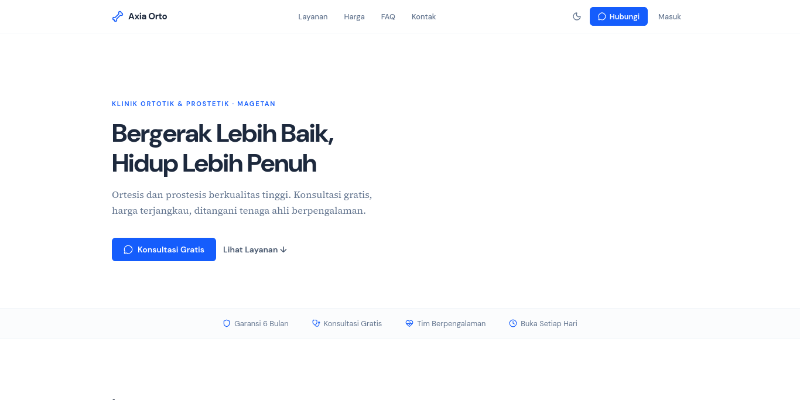

### Login
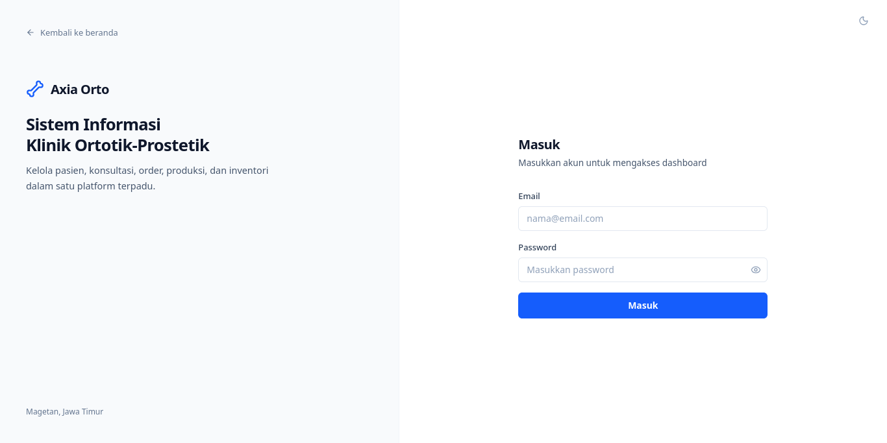

### Dashboard
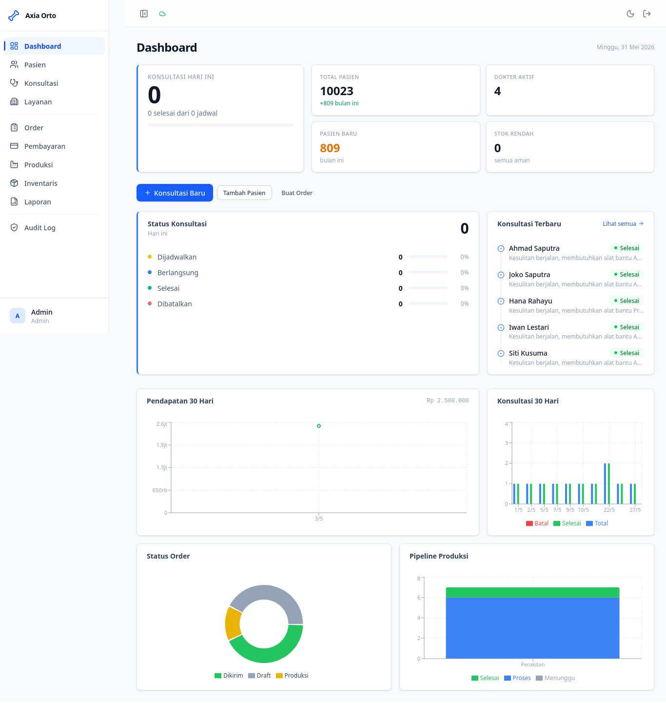

### Manajemen Pasien
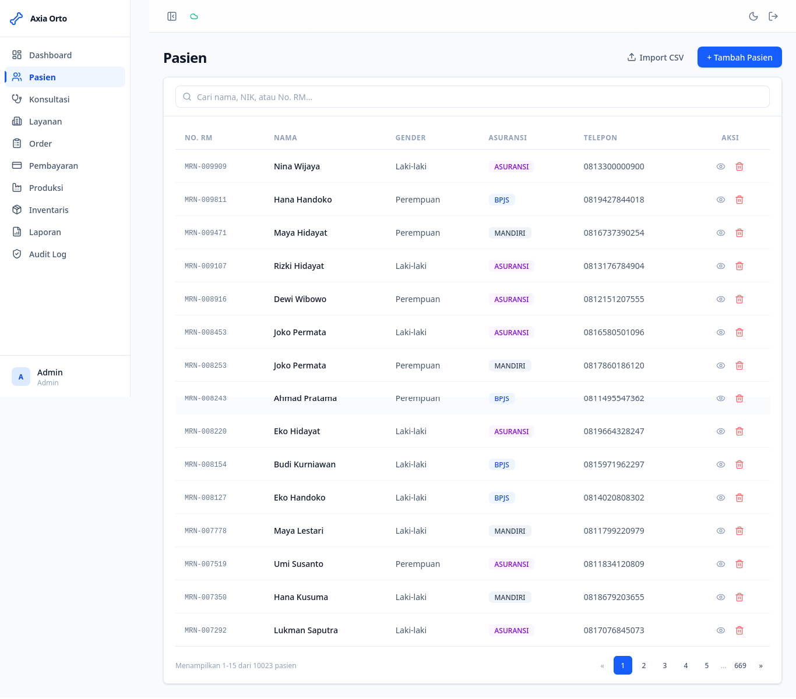

### Konsultasi
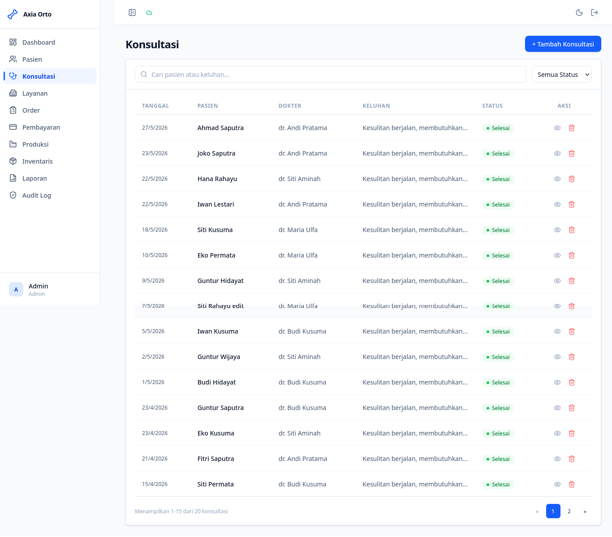

### Katalog Layanan
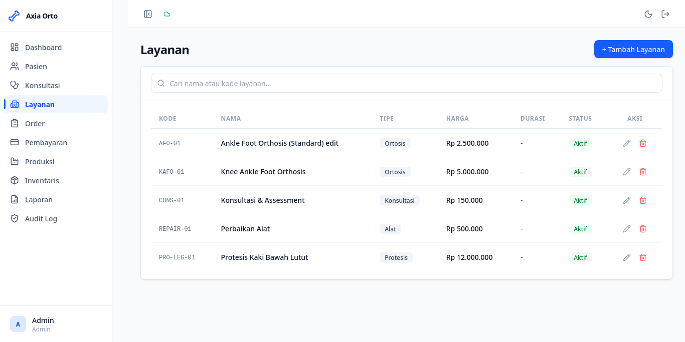

### Order Perawatan
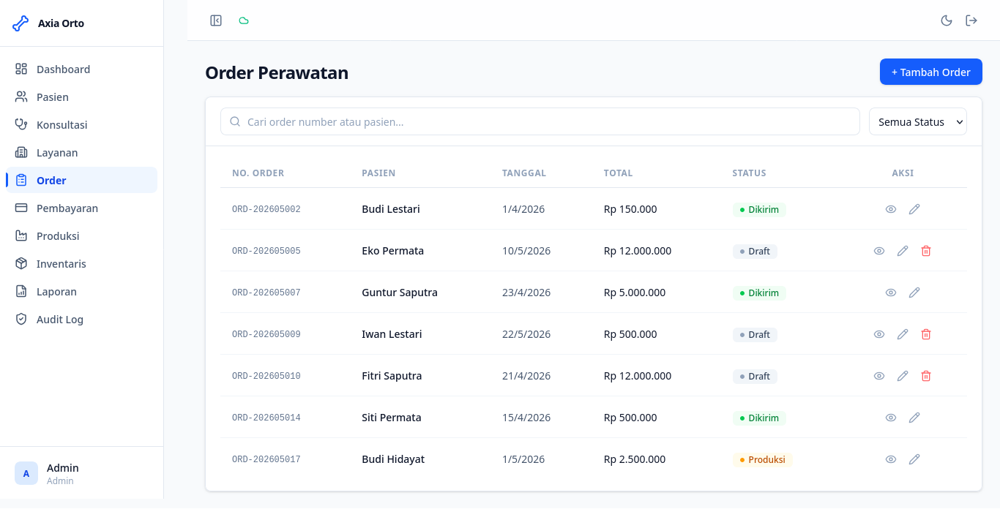

### Pembayaran
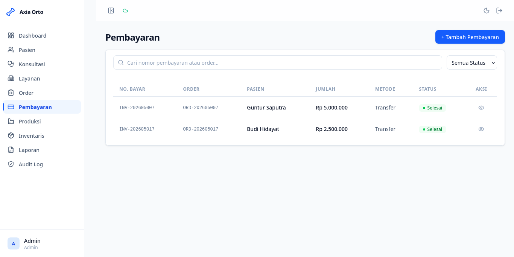

### Tracking Produksi
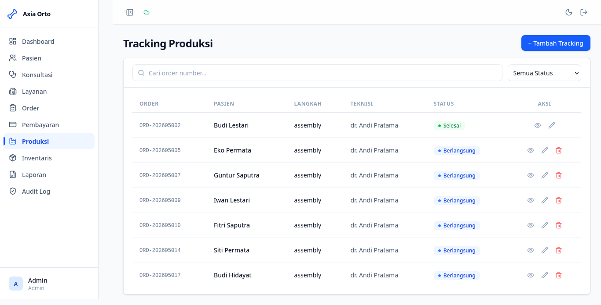

### Inventaris
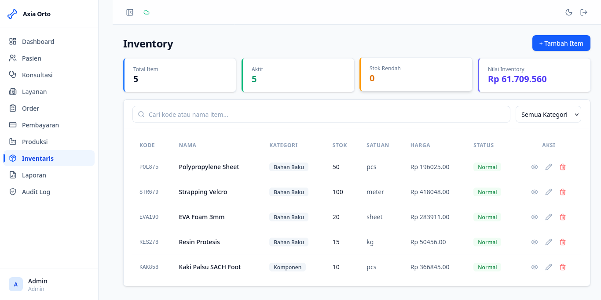

### Laporan
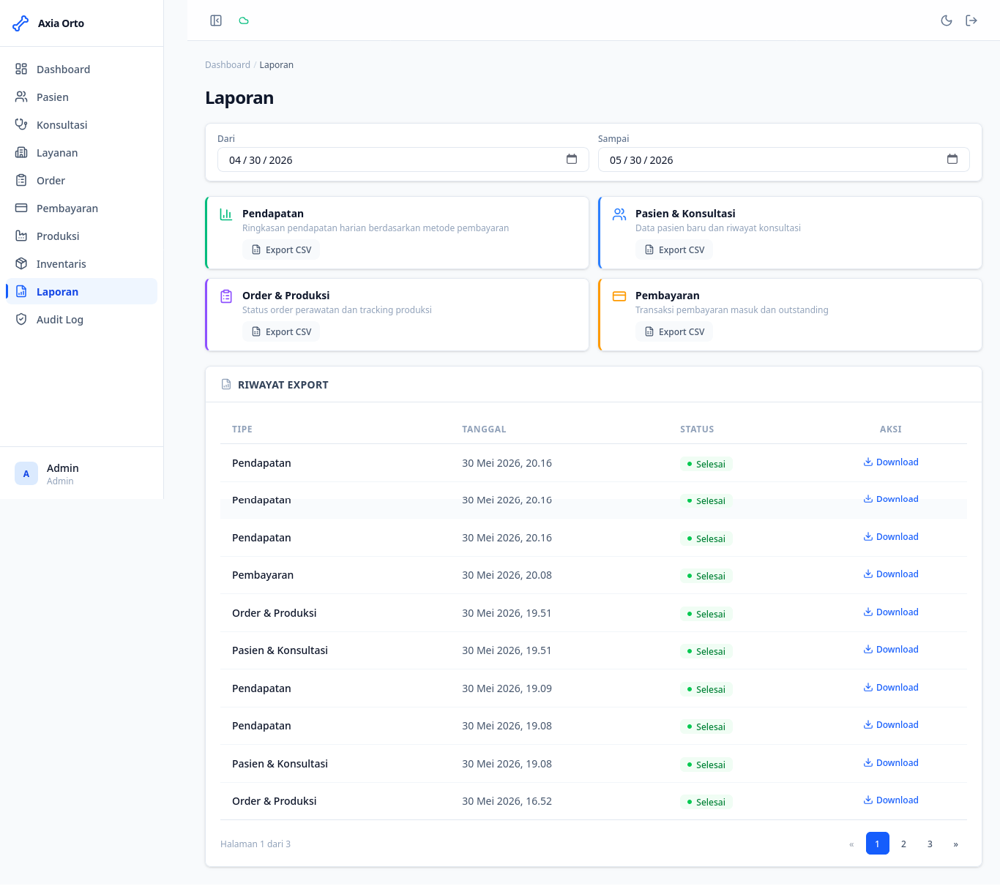

### Audit Log
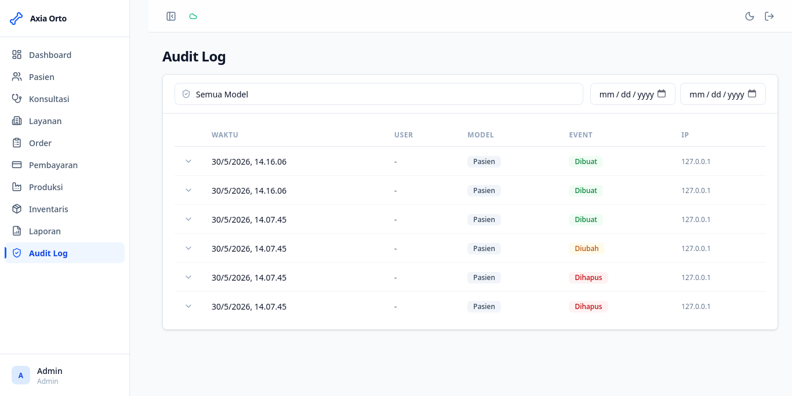

## Arsitektur

```
Browser → static files (React SPA) → Apache
  │
  │ API calls: /api/*
  ▼
Laravel API → MySQL Database
```

- React SPA dimuat dari `/app/index.html`
- Semua permintaan data melalui REST API yang dilindungi Sanctum
- Backend tidak merender HTML — hanya JSON API
- `public/app/.htaccess` menangani routing SPA di shared hosting

## Instalasi

```bash
# 1. Clone repository
git clone https://github.com/jefrykurniawan/axia-orto.git
cd axia-orto

# 2. Install dependencies backend
composer install

# 3. Install dependencies frontend
cd frontend
npm install
npm run build
cd ..

# 4. Setup environment
cp .env.example .env
php artisan key:generate

# 5. Konfigurasi database di .env
# DB_DATABASE=axiadb
# DB_USERNAME=root
# DB_PASSWORD=

# 6. Jalankan migrasi dan data awal
php artisan migrate --seed

# 7. Jalankan server
php artisan serve

# Buka browser: http://localhost:8000/app/
```

## Struktur Project

```
axia-orto/
├── frontend/                # React SPA
│   └── src/
│       ├── pages/           # Halaman-halaman aplikasi
│       ├── components/      # Komponen UI (Button, Card, Table, dll)
│       ├── hooks/           # TanStack Query hooks
│       ├── contexts/        # Auth context
│       ├── stores/          # Zustand stores
│       ├── lib/             # API client, utils
│       └── types/           # TypeScript interfaces
├── app/                     # Laravel API
│   ├── Http/Controllers/    # API controllers (JSON only)
│   ├── Models/              # Eloquent models
│   └── Observers/           # Audit trail, summary update
├── config/permissions.php   # Hak akses per role
├── routes/api.php           # Semua API routes
├── routes/web.php           # SPA catch-all (inject CSRF)
└── public/app/              # React build output
```

## Hak Akses

| Modul | Admin | Dokter | Staf Klinik | Teknisi |
|---|---|---|---|---|
| Pasien | Semua | Lihat | Semua | - |
| Konsultasi | Lihat, Hapus | Semua | Lihat | - |
| Layanan | Semua | Lihat | Lihat | - |
| Order | Semua | Buat, Lihat | Buat, Lihat, Edit | Lihat |
| Pembayaran | Semua | - | Semua | - |
| Produksi | Lihat | Lihat | Lihat | Lihat, Edit |
| Inventaris | Semua | Lihat | Tambah, Lihat | Lihat |
| Laporan | Lihat | Lihat | Lihat | - |
| Audit Log | Lihat | - | - | - |

## Deployment (Shared Hosting)

```bash
git pull origin main
composer install --no-dev --optimize-autoloader
cd frontend && npm ci && npm run build && cd ..
php artisan config:cache
php artisan route:cache
php artisan migrate --force
```

## Panduan Pengguna

Lihat [Panduan-Pengguna.md](./Panduan-Pengguna.md) untuk panduan lengkap penggunaan sistem bagi owner dan admin klinik.

## License

MIT | Laravel 10 + React 19 + MySQL

---

Dibuat oleh **Jefry Kurniawan**
