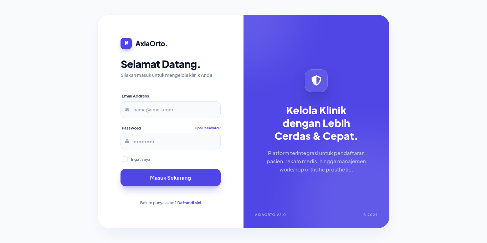
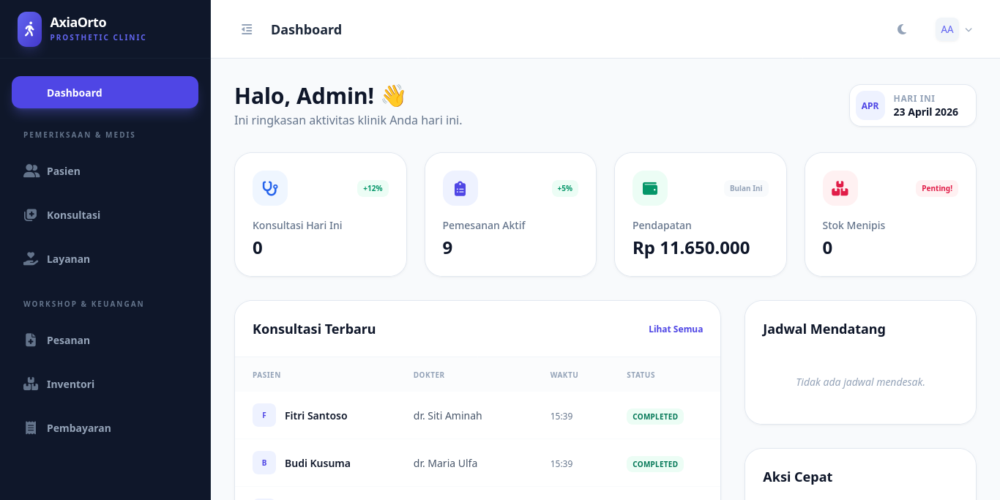
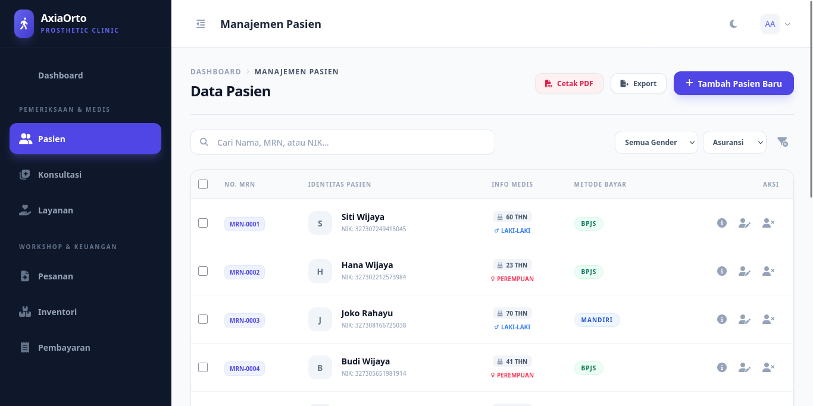
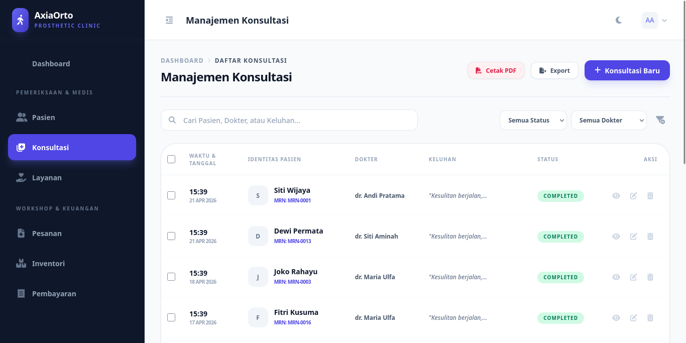
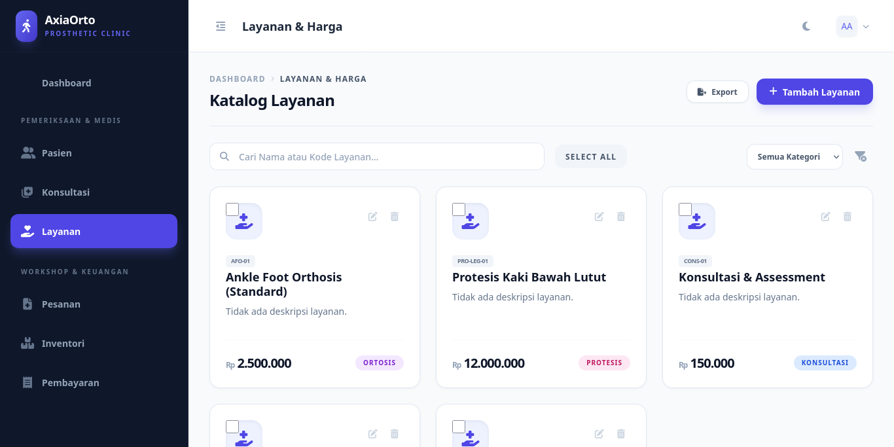
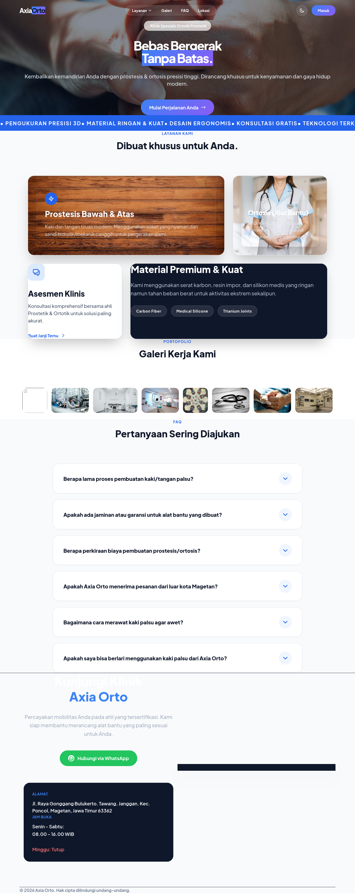

# 🦿 Axia Orto Clinic ERP

> Modern Clinic Management System for Orthotic & Prosthetic Workflows.

## 💡 Tentang Project Ini

**Axia Orto** adalah sistem manajemen klinik berbasis web yang dirancang khusus untuk menangani workflow spesifik di klinik **Ortotik dan Prostetik**.

Project ini dibuat untuk menjawab kebutuhan klinis yang butuh transisi dari pencatatan manual/paper-based menuju ekosistem digital yang terintegrasi. Fokus utamanya adalah **efisiensi operasional**: mulai dari pendaftaran pasien, konsultasi & anamnesis dokter, pembuatan SPK (Surat Perintah Kerja) untuk alat custom, hingga tracking stok material dan manajemen pembayaran.

Developed with an **MVP-first mindset**: fitur core di-launch dulu biar value-nya langsung kerasa, arsitektur tetap scalable, dan UI/UX di-polish secara bertahap.

## 🛠️ Tech Stack & Architecture

Stack yang dipilih balance antara performa tinggi, maintainability, dan developer experience modern:

- **Core Framework:** `Laravel 10.10` (PHP 8.1+) — Robust MVC structure & Eloquent ORM.
- **Interactive Frontend:** `Livewire 3` + `Alpine.js` — Real-time reactivity tanpa perlu setup heavy SPA.
- **Database:** `PostgreSQL` — Relational integrity, JSONB support for device specs, dan high concurrency.
- **Performance Layer:** `Laravel Octane` + `Redis` — Super fast boot time, optimized session handling, & caching strategy.
- **Authentication:** `Laravel Breeze` — Secure auth scaffolding yang clean.
- **Styling:** `Tailwind CSS` — Utility-first framework untuk UI yang responsif & konsisten.
- **DevOps/CI-CD:** `GitHub Actions` — Automated testing & deployment pipeline structure.

## 📸 Screenshots & Demo

### 🔐 Login Page

Halaman autentikasi dengan desain modern dan secure.


### 📊 Dashboard

Dashboard overview dengan ringkasan data harian, statistik pasien, dan quick actions.


### 👥 Manajemen Pasien

CRUD pasien dengan medical record number, data asuransi, dan riwayat alergi yang terstruktur.


### 🩺 Manajemen Konsultasi

Penjadwalan konsultasi, anamnesis, diagnosis, dan treatment planning dengan status tracking.


### 💰 Layanan & Harga

Katalog layanan ortotik & prostetik dengan manajemen harga dan durasi treatment.


### 🏥 Klinik Ortotik-Prostetik

Overview sistem manajemen klinik yang terintegrasi.


## 🎯 MVP Progress & Module Flow

Pengembangan dilakukan secara modular. Berikut status pengerjaan saat ini:

| Module                 | Features / Flow                                                      | Status         |
| :--------------------- | :------------------------------------------------------------------- | :------------- |
| 🔐 **Auth & Roles**    | Multi-role access (Admin, Dokter, Staf), secure login flow           | ✅ Completed   |
| 👥 **Patient Mgmt**    | CRUD Pasien, Medical Record (MRN), Insurance data, Allergies history | ✅ Completed   |
| 🩺 **Consultation**    | Scheduling, Anamnesis, Diagnosis, Treatment Planning                 | ✅ Completed   |
| 📦 **Treatment Order** | SPK Creation, Item breakdown (Ortosis/Protesis), Delivery estimation | ✅ Completed   |
| 📊 **Inventory**       | Material tracking, Stock alerts, Price management                    | ✅ Completed   |
| 💳 **Payments**        | Billing generation, Payment tracking, Invoicing                      | 🔄 In Progress |
| 📉 **Reports**         | Analytics dashboard, PDF Export, Financial summary                   | 🔄 In Progress |

**Highlights:**

- Core CRUD sudah berjalan lancar dengan **Route Model Binding** yang proper.
- **Livewire components** sudah di-refactor untuk interaksi yang smooth tapi tetap ringan di browser.
- **Database Schema** sudah normalized & menggunakan `Soft Deletes` untuk data safety.
- **Error Handling** & Null-safe operators sudah diimplementasi untuk mencegah crash di view layer.

## 💼 Fullstack Skills Demonstrated

Project ini bukan sekadar CRUD standar, tapi showcase kemampuan End-to-End development:

1.  **Backend Architecture:** Memahami struktur Laravel yang scalable, proper routing, service layer, & complex Model Relationships.
2.  **Reactive UI Development:** Mengimplementasikan `Livewire 3` untuk fitur dinamis (seperti real-time calculation & dynamic forms) tanpa overhead JavaScript yang berat.
3.  **Database Optimization:** Design schema PostgreSQL yang efisien, penggunaan Eager Loading untuk prevent N+1 query problem.
4.  **Performance Tuning:** Integrasi `Octane` & `Redis` untuk menangani session & caching query berat agar aplikasi tetap ngebut.
5.  **Clean Code & DX:** Menggunakan `Laravel Pint` untuk formatting, `IDE Helper` untuk autocompletion, dan validasi data yang ketat.
6.  **CI/CD Awareness:** Memahami pipeline struktur untuk auto-testing dan safe deployment workflow.

## 📦 Installation & Setup

Berikut cara untuk menjalankan project ini di local environment:

```bash
# 1. Clone repository
git clone https://github.com/jefrykurniawan/axia-orto.git
cd axia-orto

# 2. Install dependencies
composer install
npm install && npm run build

# 3. Environment setup
cp .env.example .env
php artisan key:generate

# 4. Database migration & seed (dummy data)
php artisan migrate --seed

# 5. Jalankan server (Standard or Octane)
php artisan serve
# atau untuk performa tinggi
php artisan octane:start

# Akses di browser: http://127.0.0.1:8000
```

## 🤝 Contribution

Project ini masih dalam tahap pengembangan aktif. Feedback, bug reports, atau saran fitur baru sangat diapresiasi! Feel free to open an Issue atau Pull Request.

---

Dibuat dengan ❤️ & ☕ oleh **Jefry Kurniawan**  
_License: MIT | Laravel 10 • Livewire 3 • PostgreSQL_
